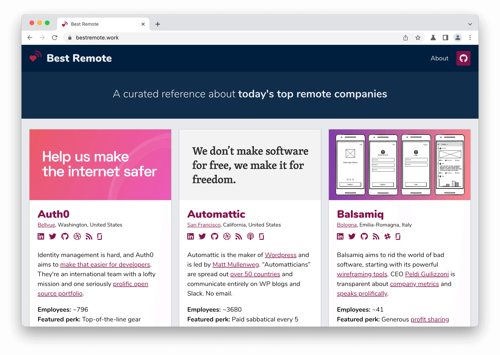

#  &nbsp;[Best Remote](https://bestremote.work)

## Overview

[Best Remote](https://bestremote.work) is a collection of resources about today's top remote-first and remote-friendly companies, organized in a clean, consumable and fun way.

## Why I made this

I've been doing a lot of research on remote companies for my next job opportunity, and it's been a useful exercise collecting it in one place. I think this may help others who are interested in remote work or organizations. There are [plenty](https://weworkremotely.com/) of [good](https://remoteintech.company/) [resources](https://github.com/lukasz-madon/awesome-remote-job/blob/master/README.md) out there on remote jobs, but none that focus specifically on gathering the most interesting information (recruitment sites, articles, blog posts, interviews, etc.) about the absolute best companies.

## My criteria

I personally gravitate towards organizations with an opinionated view of themselves and an established remote philosophy. They've thought pretty deeply about their culture and they signal that to the world, whether in the form of a well-crafted recruitment page, frequent blog posts, podcast appearances, or whatever.

I'm only featuring organizations that are “remote-only”, “remote-first” or very “remote-friendly”, not merely “remote-allowed” or those with significant geographic restrictions.

## Support this project
Best Remote will always be free but your support is greatly appreciated.

- [Buy Me a Coffee](https://www.buymeacoffee.com/edelstone)
- [Venmo](https://venmo.com/michaeledelstone)
- [Cash App](https://cash.app/$edelstone)
- [Paypal](https://www.paypal.me/edelstone)
- Bitcoin: `39t7oofR7AoZoAdH7gJLBrGnrgcJbsqmiP`
- Dogecoin: `D8TNA7iSD4i5Z3fpbTv5fpgTbq9udo8r1n`
- Ethereum: `0x830bFE848a8fda9d73bc5A93F0307401d7050A44`
- Litecoin: `MKazMHFCn3k6cQYuY37GHwrQVwhsrRf8aY`

## Credits

* Logo courtesy of [Freepik](http://www.freepik.com/) and pulled from [flaticon.com](http://www.flaticon.com/).
* This site is built using the [Bulma framework](http://bulma.io/).
* [Nunito typeface](https://fonts.google.com/specimen/Nunito) courtesy of [Google Fonts](https://fonts.google.com/).

## Feedback and contributing

If this site has been useful to you, [drop me a line](https://michaeledelstone.com/contact) to let me know. And please fork, open issues, or use any bit of this site for your own purposes.
